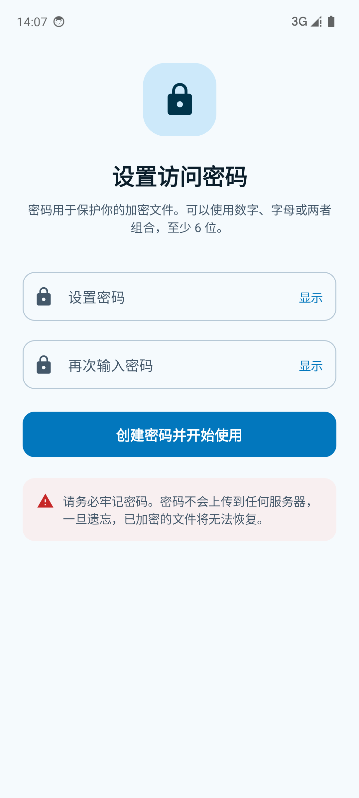
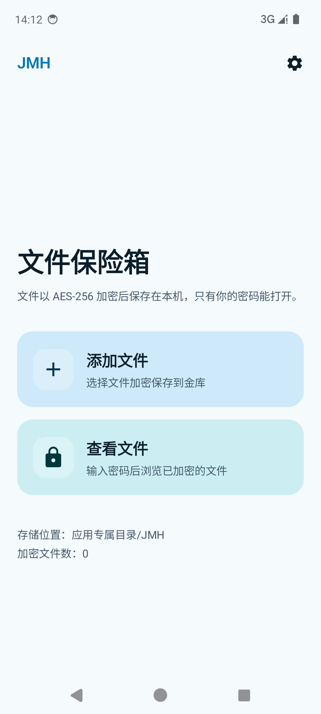
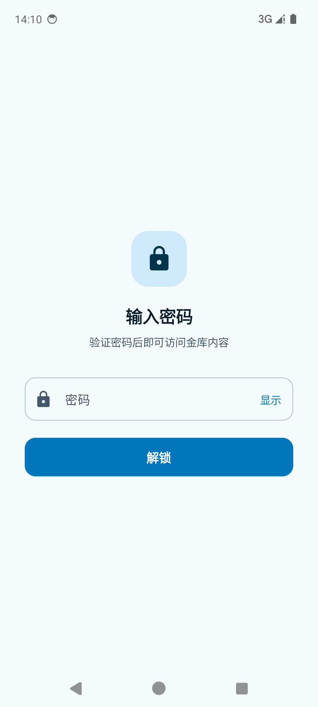
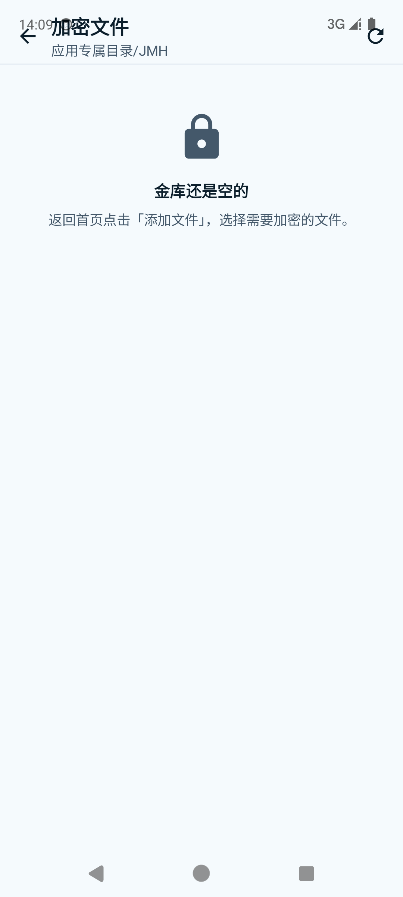
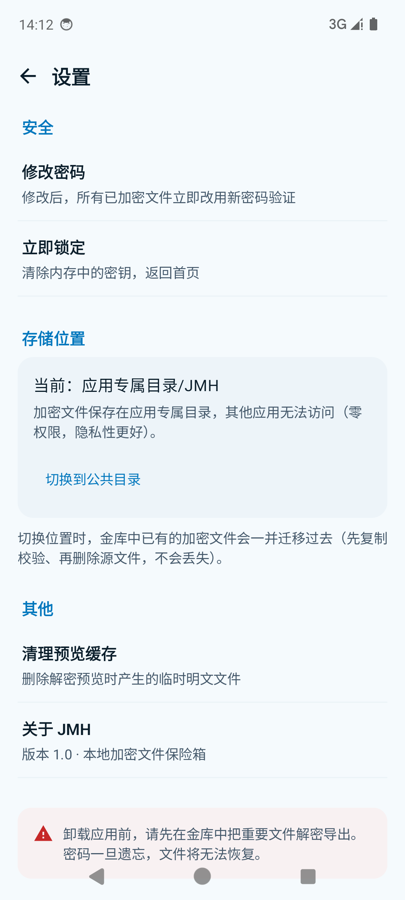

<div align="center">

# JMH · 文件加密保险箱

**一款纯本地的 Android 文件加密应用 —— 你的文件，只有你能打开**

[](https://github.com/123456789-Liu1/JMH-Android/actions/workflows/android-ci.yml)
[](LICENSE)
[](https://developer.android.com)
[](https://kotlinlang.org)
[](https://developer.android.com/jetpack/compose)

</div>

---

## 这是什么

JMH 是一款**完全离线**的 Android 文件加密工具。它把手机上的任意文件（照片、视频、文档、压缩包……）
加密成统一的 `.jmh` 格式，只有知道密码的人才能打开。

没有账号、没有云端、没有服务器。**应用甚至没有申请网络权限** —— 它在物理上无法把你的文件传出去。

| | |
|---|---|
| **加密算法** | AES-256-GCM（认证加密，防篡改） |
| **密钥派生** | PBKDF2-HMAC-SHA256 · 150,000 次迭代 · 随机盐 |
| **密钥管理** | 主密钥 + 每文件独立数据密钥（信封加密） |
| **最低系统** | Android 10（API 29） |
| **网络权限** | 无 |

---

## 截图

<p align="center">
  
  &nbsp;
  
  &nbsp;
  
</p>
<p align="center">
  
  &nbsp;
  
</p>

---

## 功能

### 加密与保护

- **强制设密**：首次启动必须设置访问密码（≥6 位，支持数字 + 字母组合），否则无法使用
- **批量加密**：一次可选择多个文件，统一转为 `.jmh` 格式
- **任意文件类型**：图片、视频、音频、文档、压缩包、APK……字节级加密，不挑格式
- **防篡改**：整个文件头参与认证，任何改动都会导致解密失败

### 浏览与预览

- **预览不落盘**：解密结果只写入应用私有缓存，退出预览立即清理，不会污染你的相册或文件管理器
- **内置预览**：图片、文本直接查看；其余格式一键调起系统应用
- **一键导出**：需要时可将文件完全解密并保存到任意位置

### 媒体播放

- 内置播放器支持 **0.5x / 1x / 1.25x / 1.5x / 2x / 3x** 倍速
- **长按画面临时 3 倍速，松手自动恢复** —— 刷长视频时特别顺手

### 存储与设置

- **双存储位置**：默认放在应用专属目录（零权限、其他应用无法访问）；
  也可授权一个公共目录，方便用文件管理器直接管理加密文件
- **无损迁移**：切换位置时自动搬运已有加密文件（先复制校验、再删源文件）
- **改密码零成本**：修改密码不需要重新加密任何文件（原理见下）
- **一键锁定**：清除内存中的密钥

---

## 加密设计

### 密钥分层（信封加密）

```
用户密码 ──PBKDF2(盐, 15万次)──▶ KEK ──加密──▶ 主密钥（随机 256 位，存于本地）
                                                    │
                                      每个文件随机生成 DEK ──被主密钥包装──▶ 存入文件头
                                                    │
                                              DEK ──▶ 加密文件内容
```

由此带来两个关键特性：

1. **同一密码、不同用户互不可解**：每个文件的盐都是随机的，即使两个人设置了一模一样的密码，
   派生出的密钥也完全不同。
2. **改密码几乎零成本**：文件内容由 DEK 加密，DEK 由主密钥包装。
   改密码时只需用新密码重新包装一次主密钥（几十字节），
   **全部历史加密文件一个字节都不用动**，新密码立即对所有文件生效。

### `.jmh` 文件格式（v1）

```
┌──────────────┬──────────────────────────────────────────┐
│ 4B  魔数     │ "JMH1"                                   │
│ 1B  版本     │ 格式版本号                                │
│ 1B  标志位   │ 保留                                     │
│ 2B  长度     │ 被包装 DEK 的长度                          │
│  N  数据     │ 被主密钥加密的 DEK（IV + 密文 + 认证标签）  │
│ 1B  长度     │ 内容 IV 长度                              │
│ 12B 内容 IV  │ 内容加密的初始向量                         │
│ 4B  长度     │ 元数据长度                                │
│  M  元数据   │ 原始文件名 / MIME / 大小 / 加密时间         │
├──────────────┼──────────────────────────────────────────┤
│  剩余全部    │ 内容密文（AAD = 以上整个文件头）            │
└──────────────┴──────────────────────────────────────────┘
```

把**整个文件头作为内容加密的附加认证数据（AAD）**，意味着攻击者无法通过替换文件头
（例如伪装成另一个文件名）来欺骗应用 —— 一旦改动，解密必然失败。

---

## 技术栈

| 层次 | 选型 |
|------|------|
| 语言 | Kotlin 2.0 |
| UI | Jetpack Compose + Material 3 |
| 播放器 | AndroidX Media3 (ExoPlayer) |
| 加解密 | JCA（`AES/GCM/NoPadding`、`PBKDF2WithHmacSHA256`） |
| 文件访问 | Storage Access Framework（SAF） |
| 异步 | Kotlin Coroutines |
| 构建 | Gradle 8.9 + AGP 8.5 |

### 项目结构

```
app/src/main/java/com/jmh/app/
├── crypto/                 加密引擎（与 UI 完全解耦）
│   ├── KeyDerivation.kt        PBKDF2 密钥派生
│   ├── CryptoBox.kt            AES-256-GCM 封装与密钥包装
│   ├── JmhFormat.kt            .jmh 容器格式定义
│   ├── JmhMeta.kt              文件元数据编解码
│   ├── JmhCryptor.kt           流式加解密（支持大文件 + 进度回调）
│   └── VaultKeyManager.kt      主密钥管理（设置 / 解锁 / 改密码）
├── storage/                存储层
│   ├── VaultDir.kt             目录抽象（应用私有 / SAF 双实现）
│   ├── VaultStorage.kt         存储位置管理与切换
│   └── JmhRepository.kt        业务编排（加密入库 / 扫描 / 预览 / 迁移）
└── ui/                     界面层
    ├── screens/                11 个 Compose 页面
    ├── components/             通用组件
    └── MainViewModel.kt        状态容器
```

---

## 构建

### 环境要求

- JDK 17 或更高
- Android SDK（Platform 34 + Build-Tools 34.0.0）
- 无需 Android Studio，命令行即可完成全部构建

### 步骤

```bash
# 1. 克隆
git clone https://github.com/123456789-Liu1/JMH-Android.git
cd JMH-Android

# 2. 指定你的 SDK 路径（复制模板后修改）
cp local.properties.example local.properties
#    或者直接设置环境变量 ANDROID_SDK_ROOT

# 3. 构建
./gradlew assembleDebug        # 调试包
./gradlew assembleRelease      # 正式包（已开启混淆与资源压缩）
```

产物位于 `app/build/outputs/apk/`。

### 运行测试

```bash
# 需要已连接设备或已启动的模拟器
./gradlew connectedDebugAndroidTest
```

9 项设备端测试覆盖：加解密往返、明文泄漏检测、错误密钥拒绝、篡改检测、
元数据读取、密钥派生、主密钥改密码，以及业务层端到端链路（加密入库 → 扫描 → 解密预览）。

### 便捷脚本（Windows）

仓库内置了几个 PowerShell 脚本，配合 `.vscode/tasks.json` 使用：

| 脚本 | 作用 |
|------|------|
| `scripts/start-emulator.ps1` | 启动模拟器并等待系统就绪 |
| `scripts/run-app.ps1` | 一键：启动模拟器 → 构建 → 安装 → 启动 |
| `scripts/build-apk.ps1` | 构建 Debug + Release 并归集到 `apk/` |
| `scripts/install-apk.ps1` | 安装已有 APK 到设备 |

在 VS Code 中按 `Ctrl+Shift+P` → `Tasks: Run Task` 即可调用。

---

## 下载

前往 [Releases](https://github.com/123456789-Liu1/JMH-Android/releases) 下载最新 APK。

> APK 使用调试签名以便直接安装体验，正式分发请自行配置签名。

---

## 常见问题

**Q：忘记密码了，能找回吗？**
不能。密码不存储在任何地方（本地只保存被它加密的主密钥），没有后门。请务必牢记。

**Q：加密文件存在哪里？**
默认在 `Android/data/com.jmh.app/files/JMH/`。也可以在设置里改为你自己授权的公共目录。

**Q：卸载应用后加密文件还在吗？**
如果在默认的应用专属目录，**卸载会一并删除**。请先在应用内解密导出，或授权公共目录。

**Q：为什么扫描不到我放在别处的 `.jmh` 文件？**
出于 Android 分区存储的限制与隐私考虑，应用只扫描它自己的金库目录。
如需在别处管理，请在设置中授权一个公共目录。

**Q：加密速度如何？**
采用 128KB 分块流式处理，大文件不会占用大量内存，处理过程有实时进度。

---

## 贡献

欢迎提交 Issue 与 Pull Request。请先阅读 [CONTRIBUTING.md](CONTRIBUTING.md)。

安全相关问题请勿公开提交，见 [SECURITY.md](SECURITY.md)。

---

## 许可证

[MIT](LICENSE) © 2026 PRCS

> 本项目仅供学习与个人使用。加密数据的安全性取决于你的密码强度，请自行承担保管责任。
